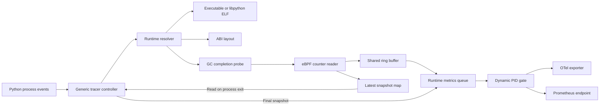

# Python runtime metrics

With `application_runtime` enabled, OBI reads cumulative garbage-collector
counters from supported CPython processes and exports all nine combinations of
these metrics and generations 0, 1, and 2:

| OTel metric | Prometheus metric | Unit |
| --- | --- | --- |
| `cpython.gc.collections` | `cpython_gc_collections_total` | `{collection}` |
| `cpython.gc.collected_objects` | `cpython_gc_collected_objects_total` | `{object}` |
| `cpython.gc.uncollectable_objects` | `cpython_gc_uncollectable_objects_total` | `{object}` |

Each point has the integer `cpython.gc.generation` attribute. OBI tracks source
counters per PID and aggregates processes that share the exported attributes.
OBI reports the main interpreter only; it does not aggregate subinterpreters.

Enable Python runtime metrics through the shared runtime metrics feature:

```yaml
metrics:
  features:
    - application_runtime
```

## Architecture

The generic tracer owns Python metric collection. A PID-scoped probe runs when
CPython completes a GC collection. The eBPF program then reads all nine
cumulative counters.



### Target setup

The resolver locates `_PyRuntime` in the mapped executable or `libpython`.
It reads the CPython version from the mapped ELF file. CPython 3.9 through 3.12
use embedded structure offsets. CPython 3.13 and 3.14 combine embedded offsets
with build-dependent values from `_Py_DebugOffsets` in the ELF file. The
resolver selects one mapped ELF object that owns `_PyRuntime`. It validates the
ELF format, CPython version, runtime layout, and probe metadata.

### Probe selection

The resolver selects a valid `python:gc__done` USDT probe as the primary probe.
On Linux `amd64`, it can also resolve a supported private collector return probe.
If USDT is unavailable, the private probe becomes the primary probe. If USDT
attachment fails, the controller tries the private probe as a fallback.

OBI attaches each probe to one PID:

| Probe | Architectures | Attachment |
| --- | --- | --- |
| `python:gc__done` USDT | `amd64`, `arm64` | PID-scoped uprobe at the USDT file offset |
| Internal GC fallback | `amd64` | PID-scoped uretprobe at the collector function file offset |

Python runtime metric activation requires a supported layout and one probe
from this table. Builds outside this table continue with OBI application tracing.

### Private collector symbols

When `python:gc__done` is unavailable, Linux `amd64` requires a recognized
private collector symbol in the mapped CPython ELF. The resolver validates the
symbol and its file offset. The controller attaches a PID-scoped uretprobe at
that offset.

Some full Docker Official Images omit SystemTap notes but retain private
collector symbols with link-time optimization (LTO) suffixes. The resolver
accepts suffixed symbols when all recognized variants identify one address.

Application tracing continues when the mapped ELF has no safe GC completion probe.

### Counter collection

The eBPF program runs after each completed GC collection. It reads the main
interpreter and all nine counters with `bpf_probe_read_user`. The program emits
a snapshot after the runtime addresses, memory reads, and counters pass validation.

The program sends each snapshot through the shared ring buffer. It also stores
the latest snapshot in a process map. The controller reads this map at process
exit and forwards the latest successfully read snapshot before removal.

Each completed GC collection performs the counter reads, snapshot-map update,
ring-buffer submission, and userspace counter update.

The snapshot contains three cumulative counters for each CPython GC generation:

```text
PythonRuntimeMetricSnapshot
└── generations 0, 1, and 2
    ├── collections
    ├── collected objects
    └── uncollectable objects
```

The exporters produce nine cumulative metric series for each exported attribute
set. They keep a separate source-counter baseline for each PID before aggregation.

## Compatibility

Python runtime metrics support validated, non-free-threaded CPython 3.9 through
3.14 final releases on Linux `amd64` and `arm64`. The embedded offset data records
the latest validated patch in each series. The offset update check extends each
series after validating a newer patch.

CPython 3.9 through 3.12 use validated per-minor layouts. CPython 3.13 and 3.14
use the runtime's `_Py_DebugOffsets` table for build-dependent structure sizes
and offsets. Compatible rebuilt and repackaged interpreters qualify through
their runtime layout, independent of ELF build ID availability. CPython 3.13
and 3.14 use an embedded `generation_stats` offset. New patch activation follows
offset update validation for that field.

Private collector probe resolution supports Linux `amd64` only. Linux `arm64`
requires a valid `python:gc__done` USDT probe.
Application tracing continues for Python targets outside this runtime-metrics
compatibility set.

## Updating offsets

Run `make update-python-offsets` from a Linux `amd64` checkout. The target
downloads the latest CPython releases, compiles the ABI validation probe, and
updates the embedded offsets and version checkpoint when the layouts remain
compatible. Review both generated files and run the Python runtime package
tests before accepting the update.

## Collection and permissions

OBI attaches one PID-scoped uprobe or uretprobe to each supported Python
process. The eBPF program reads user memory only when CPython completes a GC
collection. The Go controller consumes ring buffer events and reads the latest
snapshot once when the process exits.

Attachment requires the same BPF and process access as other OBI user probes.
Linux policy, namespaces, capabilities, and procfs visibility can deny access.
Application tracing continues when attachment fails, while Python runtime
metric collection stays inactive for that process.
