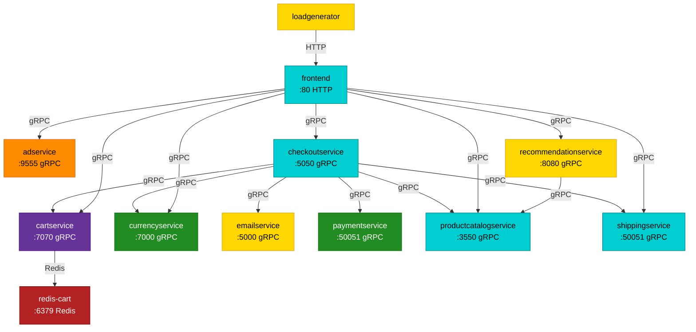

# Store Demo Architecture

This describes the service topology of the vendored Online Boutique app (`GoogleCloudPlatform/microservices-demo`, see [PROVENANCE.md](./PROVENANCE.md) for the pinned upstream version) as wired by the manifests in [`k8s`](./k8s).

> The graph and tables below are **generated** from the manifests by
> [fix_architecture.py](./fix_architecture.py). Do not edit the
> `<!-- generated:* -->` regions by hand — run the script after changing a
> manifest:
>
> ```bash
> python3 examples/store-demo/fix_architecture.py
> ```
>
> CI runs it with `--check` and fails if the doc is stale.

## Service Graph

<!-- generated:graph -->

<!-- /generated:graph -->

<!-- generated:legend -->
**Language legend:** <span style="color:darkturquoise">■</span> Go &nbsp;
<span style="color:gold">■</span> Python &nbsp;
<span style="color:forestgreen">■</span> Node.js &nbsp;
<span style="color:rebeccapurple">■</span> C# / .NET &nbsp;
<span style="color:darkorange">■</span> Java &nbsp;
<span style="color:firebrick">■</span> Redis (datastore)
<!-- /generated:legend -->

## Connections

Edges are derived from the `*_SERVICE_ADDR` / `REDIS_ADDR` / `FRONTEND_ADDR`
environment variables in the manifests.

<!-- generated:connections -->
| Caller | Callee | Address | Protocol |
| --- | --- | --- | --- |
| cartservice | redis-cart | `redis-cart:6379` | Redis |
| checkoutservice | cartservice | `cartservice:7070` | gRPC |
| checkoutservice | currencyservice | `currencyservice:7000` | gRPC |
| checkoutservice | emailservice | `emailservice:5000` | gRPC |
| checkoutservice | paymentservice | `paymentservice:50051` | gRPC |
| checkoutservice | productcatalogservice | `productcatalogservice:3550` | gRPC |
| checkoutservice | shippingservice | `shippingservice:50051` | gRPC |
| frontend | adservice | `adservice:9555` | gRPC |
| frontend | cartservice | `cartservice:7070` | gRPC |
| frontend | checkoutservice | `checkoutservice:5050` | gRPC |
| frontend | currencyservice | `currencyservice:7000` | gRPC |
| frontend | productcatalogservice | `productcatalogservice:3550` | gRPC |
| frontend | recommendationservice | `recommendationservice:8080` | gRPC |
| frontend | shippingservice | `shippingservice:50051` | gRPC |
| loadgenerator | frontend | `frontend:80` | HTTP |
| recommendationservice | productcatalogservice | `productcatalogservice:3550` | gRPC |
<!-- /generated:connections -->

## Service Languages

The node colors in the diagram above reflect the implementation language of each
service. Online Boutique is intentionally polyglot, which is why it is a good
exercise for OBI: each runtime is instrumented differently. Languages are
detected from each service's source tree under [`app/src`](./app/src).

<!-- generated:languages -->
| Service | Language | Source marker |
| --- | --- | --- |
| adservice | Java | `build.gradle` |
| cartservice | C# / .NET | `cartservice.csproj` |
| checkoutservice | Go | `go.mod` |
| currencyservice | Node.js | `package.json` |
| emailservice | Python | `requirements.txt` |
| frontend | Go | `go.mod` |
| loadgenerator | Python | `requirements.txt` |
| paymentservice | Node.js | `package.json` |
| productcatalogservice | Go | `go.mod` |
| recommendationservice | Python | `requirements.txt` |
| redis-cart | Redis (datastore) | upstream `redis:alpine` image |
| shippingservice | Go | `go.mod` |
<!-- /generated:languages -->

## Notes For OBI

- All service-to-service calls except the `loadgenerator->frontend` hop and the `cartservice->redis` hop use gRPC. This is why OBI's visibility into this demo is dominated by gRPC spans and `rpc_server_duration_seconds` metrics.
- `redis-cart` is an unmodified upstream `redis:alpine` image deployed alongside `cartservice` in [cartservice.yaml](./k8s/cartservice.yaml); every other workload runs a locally built `obi-store-demo-*:local` image.
- See [README.md](./README.md) for the current OBI visibility expectations and known gRPC propagation gaps.
