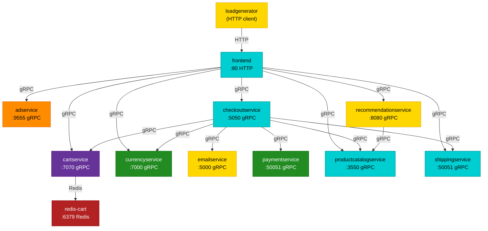

# Store Demo Architecture

This describes the service topology of the vendored Online Boutique app (`GoogleCloudPlatform/microservices-demo` v0.10.5, see [PROVENANCE.md](./PROVENANCE.md)) as wired by the manifests in [`k8s`](./k8s).

> Keep this file in sync with the manifests. When you change a `*_SERVICE_ADDR`
> env var, add or remove a service manifest, or change a listen port, update the
> diagram and the table below in the same change.

## Service Graph

**Language legend:** ■ Go &nbsp;
■ Python &nbsp;
■ Node.js &nbsp;
■ C# / .NET &nbsp;
■ Java &nbsp;
■ Redis (datastore)

## Connections

Edges are derived from the `*_SERVICE_ADDR` / `REDIS_ADDR` / `FRONTEND_ADDR`
environment variables in the manifests.

| Caller | Callee | Address | Protocol |
| --- | --- | --- | --- |
| loadgenerator | frontend | `frontend:80` | HTTP |
| frontend | adservice | `adservice:9555` | gRPC |
| frontend | cartservice | `cartservice:7070` | gRPC |
| frontend | checkoutservice | `checkoutservice:5050` | gRPC |
| frontend | currencyservice | `currencyservice:7000` | gRPC |
| frontend | productcatalogservice | `productcatalogservice:3550` | gRPC |
| frontend | recommendationservice | `recommendationservice:8080` | gRPC |
| frontend | shippingservice | `shippingservice:50051` | gRPC |
| checkoutservice | productcatalogservice | `productcatalogservice:3550` | gRPC |
| checkoutservice | shippingservice | `shippingservice:50051` | gRPC |
| checkoutservice | paymentservice | `paymentservice:50051` | gRPC |
| checkoutservice | emailservice | `emailservice:5000` | gRPC |
| checkoutservice | currencyservice | `currencyservice:7000` | gRPC |
| checkoutservice | cartservice | `cartservice:7070` | gRPC |
| recommendationservice | productcatalogservice | `productcatalogservice:3550` | gRPC |
| cartservice | redis-cart | `redis-cart:6379` | Redis |

## Service Languages

The node colors in the diagram above reflect the implementation language of each
service. Online Boutique is intentionally polyglot, which is why it is a good
exercise for OBI: each runtime is instrumented differently.

| Service | Language | Source marker |
| --- | --- | --- |
| checkoutservice | Go | `go.mod`, `main.go` |
| frontend | Go | `go.mod`, `main.go` |
| productcatalogservice | Go | `go.mod` |
| shippingservice | Go | `go.mod`, `main.go` |
| emailservice | Python | `requirements.txt`, `email_server.py` |
| loadgenerator | Python | `locustfile.py`, `requirements.txt` |
| recommendationservice | Python | `requirements.txt`, `recommendation_server.py` |
| currencyservice | Node.js | `package.json` |
| paymentservice | Node.js | `package.json` |
| cartservice | C# / .NET | `cartservice.csproj`, `Program.cs` |
| adservice | Java | `build.gradle` |
| redis-cart | Redis (datastore) | upstream `redis:alpine` image |

## Notes For OBI

- All service-to-service calls except the `loadgenerator->frontend` hop and the `cartservice->redis` hop use gRPC. This is why OBI's visibility into this demo is dominated by gRPC spans and `rpc_server_duration_seconds` metrics.
- `redis-cart` is an unmodified upstream `redis:alpine` image deployed alongside `cartservice` in [cartservice.yaml](./k8s/cartservice.yaml); every other workload runs a locally built `obi-store-demo-*:local` image.
- See [README.md](./README.md) for the current OBI visibility expectations and known gRPC propagation gaps.
